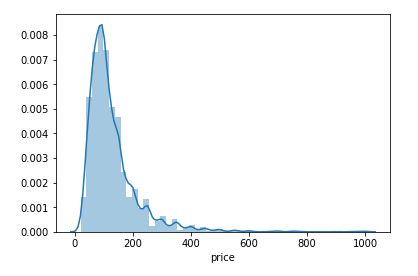
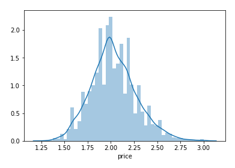
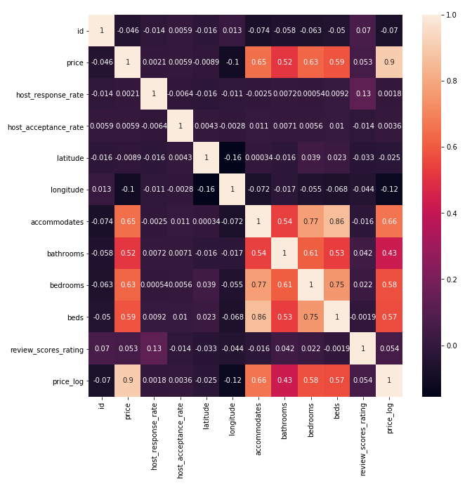
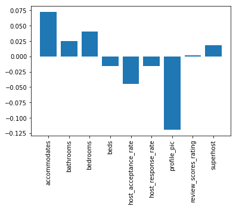
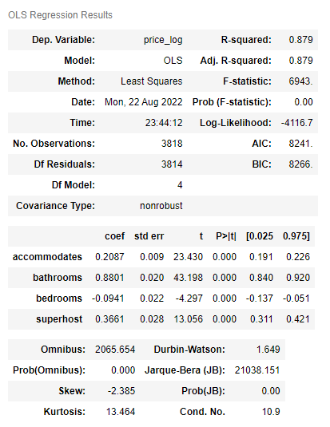
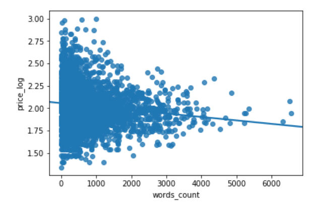

# Seattle Airbnb Analysis
Author: Zeyao Wang

## Introdution

At present, due to economic problems and war happened, banks have raised interest rates and thus affect the housing market price, so the price of Airbnb has also changed. Therefore I chose to look at the pre-pandemic 2015-2016 Seattle Airbnb data. Before the pandemic, no mask was required and oil price was reasonable, which travelers were all around the world, thus Airbnb started to take off. However recently a firestorm over fees on Airbnb erupted on social media, in which most customers pointed out the hotel was much cheaper then Airbnb and hotel became a better option. Therefore, I would like to find what important factors affect Airbnb price a lot and correlation between price and those factors. 

## Data Preparaion

I used two dataset:
- listings: includes full descriptions and average review score
- Reviews: includes unique id for each reviewer and detailed comments
 

### 1.1 Data cleaning

Firstly, I check the missing values for all listings dataset by categorizing all columns into quantitative and quanlitative columns and drop the columns with more than 60% missing values. And then fill in the missing value for quanlitative value with "None" and fill in the missing value for quantitative value column with the median.  

Following is the percentage of missing value in quantitative columns:
| Column Names  | Missing Value Percentage 
|---|---|
| monthtly_price  | 0.60  |
| security_deposit  | 0.51  |
| weekly_price  |  0.47 |
| cleaning_fee  |  0.27 |
| host_acceptance_rate  |  0.20 |
| review_score_chechin  |  0.17 |
| review_score_accuracy  |  0.17 |
| review_score_value  |  0.17 |
| review_score_location  |  0.17 |
| review_score_cleanliness  |  0.17 |
| review_score_coummnication  |  0.17 |
| review_score_rating  |  0.16 |
| review_per_month  |  0.16 |
| host_response_rate  |  0.13 |
| bathrooms  |  0.004 |
| bedrooms  |  0.002 |
| host_listings_count  |  0.0005 |
| host_total_listings2_count  |  0.0005 |
| beds  |  0.0002 |

### 1.2 Price Value Transform

 I mainly focus on the price column which is the dependent variable in the model, thus I check the distribution of price value and find that the distribution of price are skewed to right and Kurtosis is 16. Therefore, I transform price value to log(price) which is normal distribution with skewness 0.37 and Kurtosis 0.37, which mean the log(price) distribution is fairly symmetrical. Hence, I use log(price) as dependent variable in the further analysis. 

Price Distribution:  

Log Price Distribution:  

### 1.3 Correlation

 After checking the correlation between log(price) and other variables, price shows the positive correlation with accommondates indicator, bathroom numbers, bedroom numbers, beds numbers. Meanwhile, accommodates indicator has the strong positive correlation with bathroom and bedrooms. 

## Model
I would like to find which variables affect price mostly and make higher price, thus I include host response rate, host acceptance rate, whether the host is superhost, accommodates indicator, bathrooms, bedrooms, beds, review_score_rating, and whether host has profile picture as independent variables, log(price) as dependent variable, and then find the important features. 

`Model 1: Log(price) = b1*host_response_rate + b2*host_acceptance_rate + b3*superhost + b4*accommodates + b5*bathrooms + b6*bedrooms + b7*beds + b7*review_score_rating + b8*profile_pic + e`

After find the important feature of model 1, I use the top four important features as independent variables as model 2. 

`Model 2: Log(price) = b1*accommodates + b2*bathrooms + b3*bedrooms + b4*superhost + e`

According to the result of Model 2, the bathroom shows the highested positive relationship with price and those four important features make bedrooms become a small negative relationship with price. 

## Comments vs. Price
In addition, I also would like to find how to make the price higher in another way, so I take a look at the relationship of price with comments. Firstly, I mainly focus on the comments in 2015-2016 and convert all single comments into tokens to calculate how many words in the comment. The result is surprised me because after add comment words count into the model, the coeficient of that is -1.4e^-05. 

## Summary
In this project, I found the factors that affect Airbnb price mostly, including bedroom number, bathroom numbers, accommendation indicator and whether the host is superhost. In addition, I also would like to find what other factor such as comment can make Airbnb price more successful, in which the result is very surprised me, thus I would like to dig into it more in the future research.

